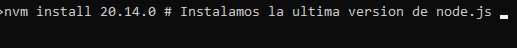
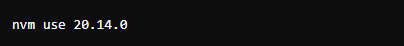
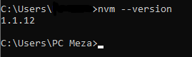
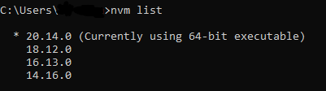

# INSTALACION DE NODE.JS CON NVM (Node Version Manager)

## ¿Que es NVM?

NVM (Node Version Manager) es una herramienta que permite administrar varias versiones de Node.js en un mismo sistema. Esto es util para proyectos que requieren versiones específicas de Node.js o para manejar actualizaciones de versiones de manera sencilla.

## ¿Como instalar NVM para windows?

Para instalar NVM (Node Version Manager) en Windows utilizando el enlace especifico proporcionado en las releases de GitHub por Corey Butler,sigue estos pasos:

1. Acceder al enlace de releases de NVM para windows

    - Visita el Github de Corey Butler para instalar la version nvm-setup.zip por medio de este link (https://github.com/coreybutler/nvm-windows/releases)

    - En ese enlace tambien encontraras todas las versiones disponibles de NVM para windows que ha publicado Corey Butler

2. Ejecucion del instalador: 

    - Una vez descargado el archivo descomprimelo si es necesario y ejecuta el archivo nvm-setup.exe u otro archivo ejecutable segun la version descargada

    - Sigue las instrucciones en pantalla para completar la instalacion de NVM en tu sistema windows 

3. Configuracion en el cdm o en PowerShell

    - Despues de la instalacion, abre como administrador tu terminal preferido (cmd o PowerShell)

    - Utilizamos los comandos de NVM para instalar y gestionar las versiones de Node.js, en este caso vamos a instalar la ultima version de Node.js que es la v20.14.0 por ejemplo

        

    - Una vez instalada la version 20.14.0 asegurate de activarla con el siguiente comando:

        

        Esto garantizara que estas utilizando la version especifica de Node.js que acabas de instalar

    - Tambien podemos verificar nuestra version de node.js con este comando:

        

    - Si instalas mas de 1 version podremos verificar las versiones de Node.js y la version activa actualmente con este comando: 

        

        Esto te mostrara una lista de todas las versiones de Node.js instalas en tu sistema y resaltara la version actualmente activa.

## INICIALIZAR UN PROYECTO DE NODE.JS 

Para inicializar un proyecto utilizamos npm init que es un comando que se utiliza para crear un nuevo proyecto Node.js y crear un archivo package.json y ademas es un gestor de paquetes de node.js y son uno de los paquetes mas grandes en el mundo porque es el quien guarda todo los archivos.

```
npm init 
```

## Dependencia de desarrollo

Una dependencia de desarrollo en el contexto de Node.js y npm se refiere a un paquete o modulo que es necesario para el proceso de desarrollo y no para la ejecucion del codigo en produccion. Con el comando npm install -D axios se utiliza para instalar el paquete axios como una dependencia de desarrollo en un proyecto Node.js. La opción -D indica a npm que el paquete debe ser instalado como una dependencia de desarrollo

```
npm install -D axios // Instalamos axios 
```

## Dependencia de produccion 

Una dependencia de producción en Node.js se refiere a un paquete o modulo que es necesario para que la aplicación funcione correctamente en un entorno de producción. Estas dependencias se especifican y se instalan usando npm install nombre-del-paquete.

```
npm install react-dom 
```

## Dependencia global

Una dependencia global en Node.js se refiere a un paquete o modulo que se instala de manera global en el sistema lo que significa que esta disponible para ser utilizado en cualquier proyecto sin necesidad de instalarlo localmente en cada uno.

```
npm instal -g nodemon
```


